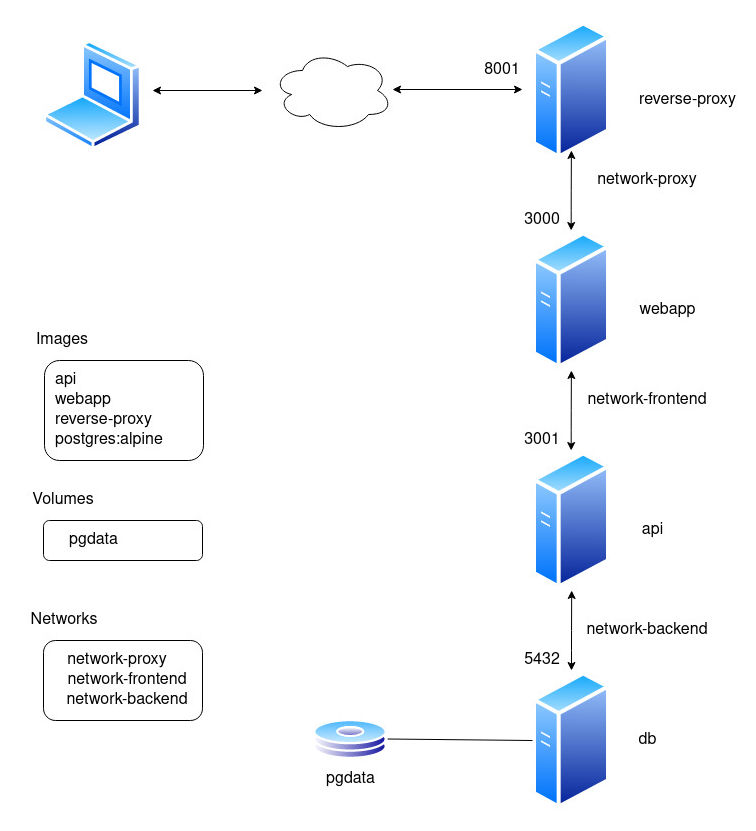

# 4 tiers application demo with docker and docker-compose
Application demo composed by:
- 4 services (db, api server, fe server, reverse-proxy)
- 3 networks
- 1 volume
## Architecture

## Usege
- clone this repository
- add new records in `sql-scripts/init.sql` file (optional)
- start containers with docker-compose (or, just to learn how it works, follow the [manual steps](manual-steps.md)):
```
docker compose up -d
```
- open a browser on `http://<your-ip-here>:8001`:


## Directories structure
```
├── api
│   ├── Dockerfile
│   ├── index.js
│   └── package.json
├── docker-compose.yaml
├── reverse-proxy
│   ├── default.conf
│   └── Dockerfile
├── sql-scripts
│   └── init.sql
└── webapp
    ├── Dockerfile
    ├── index.js
    └── package.json
```

