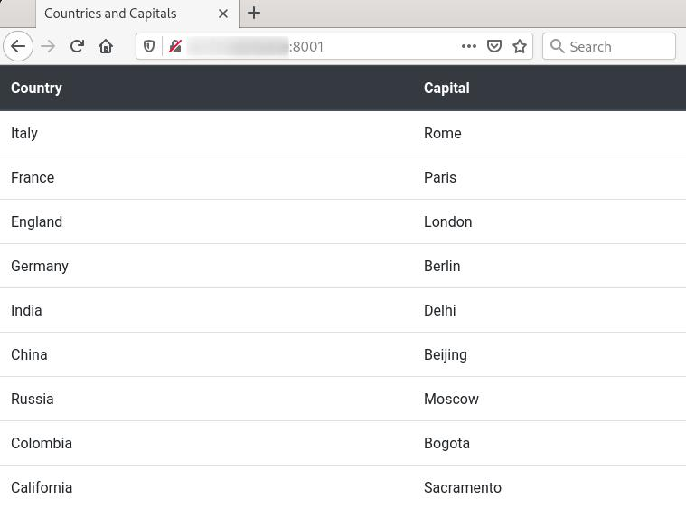

# Manual steps
- Create the volume pgdata for postgres db:
```
$ docker volume create pgdata
```
- Create the three networks:
```
$ docker network create network-backend
$ docker network create network-frontend
$ docker network create network-proxy
```
- Create custom images for api, webapp and reverse-proxy:
```
$ docker build -t api api
$ docker build -t webapp webapp
$ docker build -t reverse-proxy reverse-proxy
```
- Start the db container:
```
$ docker container run --detach \
                       --env POSTGRES_USER=myuser \
                       --env POSTGRES_PASSWORD=mypassword \
                       --env POSTGRES_DB=mydb \
                       --volume $PWD/sql-scripts/:/docker-entrypoint-initdb.d:ro \
                       --volume pgdata:/var/lib/postgresql/data \
                       --network network-backend \
                       --name db \
                       --hostname db \
                       postgres:alpine
   
```
- Check if db has been created and populated with provided data with a temporary container for the client:
```
$ docker ps
CONTAINER ID        IMAGE               COMMAND                  CREATED             STATUS              PORTS               NAMES
da954843a807        postgres:alpine     "docker-entrypoint.s…"   8 minutes ago       Up 8 minutes        5432/tcp            db

$ docker logs db
<...>
2021-02-08 08:16:24.990 UTC [1] LOG:  database system is ready to accept connections

$ docker container run -it --rm --network network-backend --env PGPASSWORD=mypassword postgres:alpine psql -U myuser -h db mydb -c 'SELECT * FROM country_and_capitals'
  country   |  capital   
------------+------------
 Italy      | Rome
 France     | Paris
 England    | London
 Germany    | Berlin
 India      | Delhi
 China      | Beijing
 Russia     | Moscow
 Colombia   | Bogota
 California | Sacramento
(9 rows)

```
- When db is up & running start the api container:
```
$ docker container run --detach \
                       --env CONNECTION_STRING=postgres://myuser:mypassword@db/mydb \
                       --network network-backend \
                       --name api \
                       --hostname api \
                       api
```
- Connect api to frontend network:
```
$ docker network connect network-frontend api
```
Check if api container exposes json data collected from db (python is used just to format the output):
```
$ docker ps
CONTAINER ID        IMAGE               COMMAND                  CREATED             STATUS              PORTS               NAMES
a6bd36734d0a        api                 "docker-entrypoint.s…"   25 minutes ago      Up 25 minutes       3001/tcp            api
da954843a807        postgres:alpine     "docker-entrypoint.s…"   38 minutes ago      Up 38 minutes       5432/tcp            db

$ docker logs api
Backend rest api listening on port 3001!

$ docker container run --rm --network network-frontend appropriate/curl -s http://api:3001/data | python -m json.tool
{
    "data": [
        {
            "country": "Italy",
            "capital": "Rome"
        },
        {
            "country": "France",
            "capital": "Paris"
        },
 <...>
    ]
}
```
- When api is up & running start webapp container:
```
$ docker container run --detach \
                       --env API_URL=http://api:3001/data \
                       --network network-frontend \
                       --name webapp \
                       --hostname pwebapp \
                       webapp
```
- Connect webapp to proxy network:
```
$ docker network connect network-proxy webapp
```
- Check if webapp container exposes formatted data collected from api:
```
$ docker ps
CONTAINER ID        IMAGE               COMMAND                  CREATED             STATUS              PORTS               NAMES
fcc56920eb7c        webapp              "docker-entrypoint.s…"   4 seconds ago       Up 2 seconds        3000/tcp            webapp
a6bd36734d0a        api                 "docker-entrypoint.s…"   26 minutes ago      Up 26 minutes       3001/tcp            api
da954843a807        postgres:alpine     "docker-entrypoint.s…"   39 minutes ago      Up 39 minutes       5432/tcp            db

$ docker logs webapp
Frontend app listening on port 3000!

$ docker container run --rm --network network-proxy appropriate/curl -s http://webapp:3000
<!doctype html>
<html lang="en">
  <head>
<...>
</html>
```
- When webapp is up & running start reverse proxy container:
```
$ docker container run --detach \
                       --publish 8001:80 \
                       --network network-proxy \
                       --name reverse-proxy \
                       --hostname reverse-proxy \
                       reverse-proxy
```
- Check if reverse-proxy container exposes the service on port 8001 of your host and forwards all requests to http://webapp:3000:
```
$ docker ps
CONTAINER ID        IMAGE               COMMAND                  CREATED             STATUS              PORTS                  NAMES
5fc88df13dd6        reverse-proxy       "/bin/sh -c 'exec ng…"   3 seconds ago       Up 2 seconds        0.0.0.0:8001->80/tcp   reverse-proxy
fcc56920eb7c        webapp              "docker-entrypoint.s…"   10 minutes ago      Up 10 minutes       3000/tcp               webapp
a6bd36734d0a        api                 "docker-entrypoint.s…"   37 minutes ago      Up 37 minutes       3001/tcp               api
da954843a807        postgres:alpine     "docker-entrypoint.s…"   50 minutes ago      Up 50 minutes       5432/tcp               db
```
- Open a browser on `http://<your-ip-here>:8001`:


